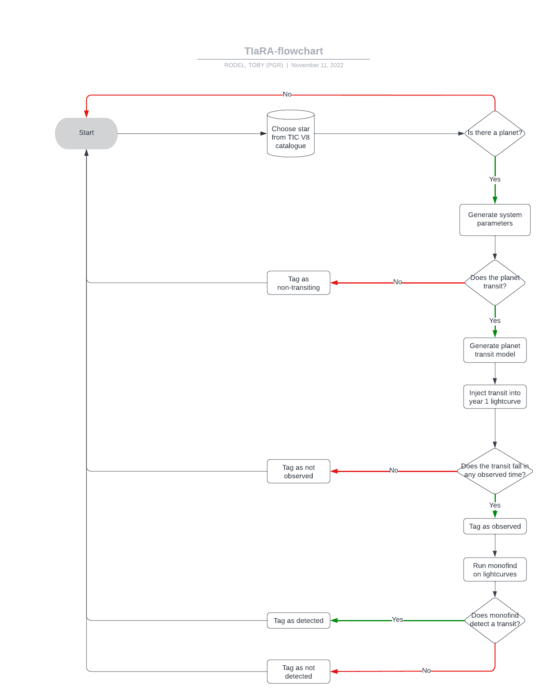

# TIaRA: Tess Injection and Recovery Application/Algorithm
## A pipeline for generating synthetic transits and injecting them into TESS data

Below is a flow chart showing the intended function of TIaRA

This pipeline makes use of the <code>BATMAN</code> package, which can be found [Here](https://github.com/lkreidberg/batman)
