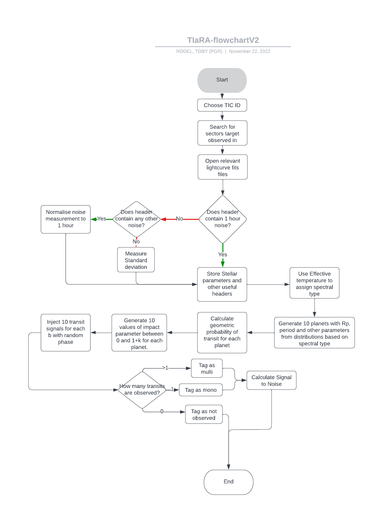

# TIaRA: Tess Injection and Recovery Application/Algorithm
## A pipeline for generating synthetic transits and injecting them into TESS data
The full pipeline is designed to run on the University of Warwick's SCRTP systems although this repository contains a folder of jupyter notebooks containing code for demonstration purpose that should run on any UNIX or windows machine.

Below is a flow chart showing the intended function of TIaRA for one lightcurve

Each run of TIaRA on a lightcurve will produce a table of information in a <code>pandas<\code> dataframe. The results from each run will be appended to a larger dataframe to be stored in a comma separated variable (<code>.csv<\code>) file. The information in this table will allow us to calculate the sensitivty of TESS to planets of different periods and radii which we will then normalise by the geometric probability of transit for each generated system and the number of planets expected per Star to estimate a yield for the TESS mission.
